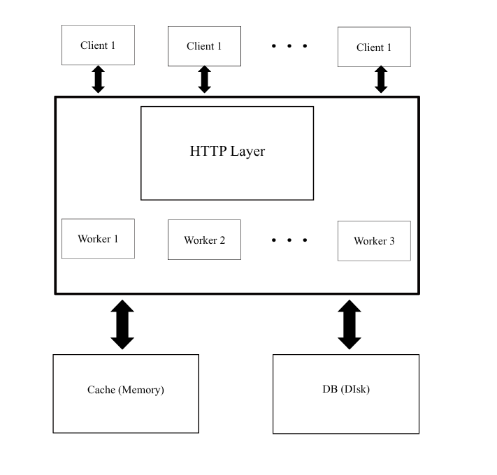

# ChatQueue

## Introduction

ChatQueue is a multi-client chat application that allows clients to send and receive messages via a central server. Messages are stored on the server and can be retrieved by clients. The system supports features such as sending messages, tracking unread messages, reading message history, and deleting messages. ChatQueue is designed to handle concurrent messaging, in-memory caching, and persistent storage for reliability and performance.

---

## Architecture Diagram


---

## How ChatQueue works
ChatQueue is structured to handle multiple clients efficiently, with each request flowing through distinct layers:

1. REST API Layer<br>
Clients interact with the server through HTTP endpoints powered by cpp-httplib. These endpoints manage sending messages, fetching unread messages, viewing message history, and deleting messages.

2. Fast Access Cache<br>
To minimize database lookups and speed up message retrieval, recent messages are stored in an in-memory cache. Each client has a dedicated message queue, and older or least-accessed clients are evicted when the cache reaches capacity.

3. Database Layer<br>
All messages are reliably saved in a MySQL database. If a requested message is not in the cache, it is retrieved from the database, ensuring that clients can access complete history and maintain consistency across sessions.
---
## Message FLow 
When a client sends a message, it first hits the REST API, which immediately inserts the message into the in-memory cache for fast access. The cache organizes messages per client and keeps track of unread counts. Simultaneously, the message is asynchronously saved to the database to ensure persistence.

When a client requests their messages, the system first checks the cache for unread messages. If some messages are missing or the client’s queue isn’t in the cache, the server fetches them from the database. After delivery, the system marks messages as read and updates both the cache and database to maintain consistency. This layered flow ensures fast, concurrent messaging while keeping a complete and reliable message history.

---

## Database Design
The database uses two tables to provide persistent storage for clients and messages.

Clients Table

- id (INT, Primary Key) – Unique identifier for each client.

- is_active (BOOLEAN) – Tracks if a client is active or deactivated.

Messages Table

- id (INT, Primary Key) – Unique message ID.

- sender_id (INT) – ID of the client who sent the message.

- receiver_id (INT) – ID of the recipient client.

- msg (TEXT) – The actual message content.

- is_read (BOOLEAN, default FALSE) – Tracks if the message has been read by the receiver.

- created_at (TIMESTAMP, default CURRENT_TIMESTAMP) – Timestamp of message creation.

---

## Cache Design
The system also uses an in-memory cache which stores recently accessed messages and manages clients for fast retrieval:

1. Client Nodes

- Each client has a deque of messages, with the most recent messages at the front.

2. Cache Storage

- clientList (list) – Maintains LRU order of clients for eviction purposes.

- clientMap (unordered_map) – Maps client_id to its node in the list for fast access.

3. Eviction Policy

- LRU (Least Recently Used): If the cache exceeds maxClients, the least recently active client is removed.

- Each client has a maximum message limit (maxMsgsPerClient), and older messages are discarded when the limit is exceeded.

4. Thread Safety

- All cache operations are protected by a mutex, enabling safe concurrent access from multiple threads.

---

## API Endpoints
| **HTTP Method** | **Endpoint**              | **Description**                         | **Request Body / Parameters**                                 | **Response**                         |
| --------------- | ------------------------- | --------------------------------------- | ------------------------------------------------------------- | ------------------------------------ |
| POST            | `/register`               | Register a new client                   | None                                                          | `{ "client_id": <id> }`              |
| POST            | `/message`                | Send a message to another client        | `{ "sender_id": <id>, "receiver_id": <id>, "msg": "<text>" }` | `{ "status": "Message stored" }`     |
| GET             | `/message/{client_id}`    | Get unread messages for the client      | `client_id` in URL                                            | JSON array of unread messages        |
| GET             | `/history/{client_id}`    | Get full message history for the client | `client_id` in URL                                            | JSON array of all messages           |
| DELETE          | `/message/{client_id}`    | Delete all messages for the client      | `client_id` in URL                                            | `{ "status": "Messages deleted" }`   |
| DELETE          | `/deactivate/{client_id}` | Deactivate a client account             | `client_id` in URL                                            | `{ "status": "Client deactivated" }` |

---

## External Libraries
This project leverages several external libraries to simplify development and improve performance. cpp-httplib is used for handling HTTP server and client operations, while nlohmann/json enables easy parsing and serialization of JSON data. The MySQL Connector/C++ X DevAPI manages persistent storage of client and message data in the database. dotenv-cpp is employed to load environment variables from a .env file, keeping sensitive configuration secure. Additionally, standard C++ libraries like thread, mutex, and chrono provide concurrency and synchronization for handling multiple client requests efficiently.

---

## Setup and Execution Guide
### Clone the Repository
```bash
git clone https://github.com/<your-username>/ChatQueue.git
cd ChatQueue
```
### Prerequisites
Make sure you have the following installed on your system:

- CMake (version 3.10 or higher)

- g++ / clang++ (C++17 or later)

- MySQL Server

### Configure Environment Variables
Create a .env file inside the root directory and define the following keys:
```bash
DB_HOST=localhost
DB_PORT=3306
DB_USER=user_name
DB_PASSWORD=password
DB_NAME=db_name
```

### Build the Project
From the root directory:
```bash
mkdir build
cd build
cmake ..
make
```
### Run the Server
```bash
./server
```
### Run the Client
```bash
./client
```

